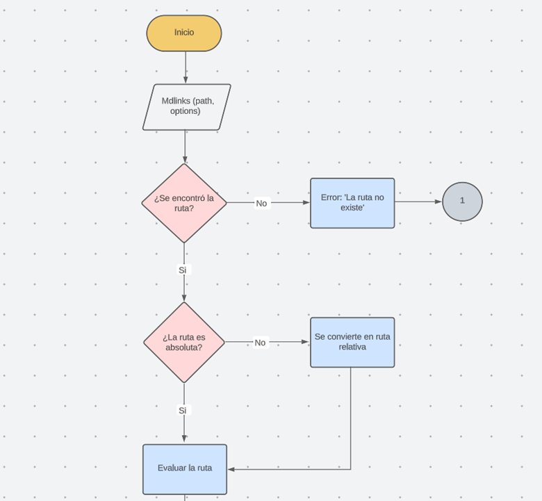
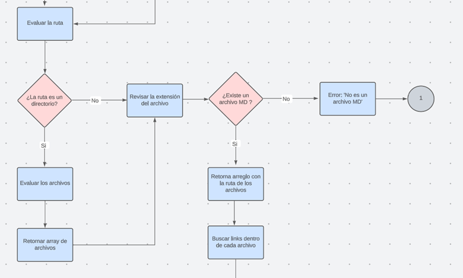
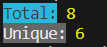

# Markdown Links

## Índice

* [1. Introducción](#1-preámbulo)
* [2. Detrás del proyecto](#2-detrás-del-proyecto)
* [3. Instalación](#3-instalación)
* [4. Uso de la librería](#4-uso-de-la-librería)
* [5. Ejemplos de uso](#5-ejemplos-de-uso)
* [6. Demo](#6-demo)

***


## 1. Introducción

💡Imagina una solución avanzada para el desafío de los enlaces rotos en archivos Markdown. Nuestra librería impulsada por Node.js se presenta como un aliado imprescindible para cualquier creador que trabaje con este lenguaje de marcado. ¿El problema? Enlaces rotos que perjudican la integridad de tus contenidos y la percepción de tu trabajo. Nuestra librería no solo detecta estos enlaces quebrados, sino que también proporciona un análisis exhaustivo y estadísticas claras.

En un entorno donde Markdown es esencial, como GitHub y blogs, nuestra librería marca la diferencia. Imagina una herramienta que se convierte en tu propio guardián de enlaces, examinando tus archivos Markdown y asegurándose de que todos los enlaces estén en perfecto estado. Esto no solo te libera de la frustración de los enlaces rotos, sino que también te permite tomar decisiones informadas sobre la calidad de tus enlaces, destacando en la comunidad de código abierto.

No te conformes con la mediocridad de enlaces rotos. Nuestra Revolucionaria Librería de Análisis de Enlaces y Estadísticas te empodera para optimizar tus archivos Markdown. Unirse a nosotros es tomar el control de la calidad de tus enlaces y elevar tu experiencia en Markdown a niveles insospechados. Marca la diferencia hoy mismo y dile adiós a los enlaces rotos.


## 2. Detrás del proyecto 

Primero, se estableció la ruta necesaria para alcanzar los resultados deseados por el usuario. A continuación, se presenta un diagrama de flujo que ilustra los requisitos para extraer los enlaces de cada archivo y la implementación de la recursividad en este proyecto. 





## 3. Instalación 

Se requiere que tenga instalada ```node.js``` versión 16 o superior

Debe utilizar el siguiente comando: 

```bash
 npm install md-links-kath
```

## 4. Uso de la librería 

* Una vez que la librería sea instalada, podrá proporcionar los siguientes datos en la terminal: 

```bash
 md-links <path> [options]
```

* **Path**  Es la ruta relativa o absoluta que el usuario ingresa.
* **Options** a ejecutar (--validate, --stats, --validate --stats).


## 5. Ejemplos de uso 

1. **Opción 1:** La implementación actual no incorpora las opciones `--validate` o `--stats`. La funcionalidad actual se centra en mostrar los enlaces presentes en los archivos .md, la ruta en la que se encuentra cada enlace y su texto vinculado. No hay preocupación en caso de que la ruta señalada sea una carpeta con subdirectorios, ya que la librería tiene la capacidad de escanear y leer incluso en estas estructuras jerárquicas, asegurando una cobertura exhaustiva.

```sh
$ md-links ../prueba 
C:\Users\USUARIO\Desktop\Laboratoria\Proyecto 4\DEV008-md-links\prueba\directorio1\prueba1.md https://caniuse.com/ CanIuse
C:\Users\USUARIO\Desktop\Laboratoria\Proyecto 4\DEV008-md-links\prueba\directorio1\prueba1.md https://www.busuu.com/dashboard#/timeline/b1 Bussu
C:\Users\USUARIO\Desktop\Laboratoria\Proyecto 4\DEV008-md-links\prueba\directorio1\prueba1.md https://www.busuu.com/dashboard#/timeline/b1 Bussu
```

2. **Opción 2:** La implementación actual incorpora la opción `--validate`. La funcionalidad actual se centra en mostrar los enlaces presentes en los archivos .md, la ruta en la que se encuentra cada enlace, su texto vinculado y un mensaje de validación (en caso de que la ruta se encuentre rota el mensaje será "Not found"). 

```sh
$ md-links ../prueba --validate
C:\Users\USUARIO\Desktop\Laboratoria\Proyecto 4\DEV008-md-links\prueba\directorio1\prueba1.md https://app.slack.com/client/T0NNB6T0R/D0577RP44AG Slack 200 OK
C:\Users\USUARIO\Desktop\Laboratoria\Proyecto 4\DEV008-md-links\prueba\directorio1\prueba1.md https://caniuse.com/ CanIuse 200 OK
C:\Users\USUARIO\Desktop\Laboratoria\Proyecto 4\DEV008-md-links\prueba\directorio1\prueba1.md https://www.busuu.com/dashboard#/timeline/b1 Bussu 200 OK
```
3. **Opción 3:** La implementación actual incorpora la opción  `--stats`. La funcionalidad actual se centra en mostrar las estadísticas de cada enlace (Total y enlaces únicos)

```sh
$ md-links ../prueba --stats
Total: 3
Unique: 3
```

4. **Opción 4:** La implementación actual incorpora las opciones `--validate` y `--stats`. La funcionalidad actual se centra en mostrar las estadísticas de cada enlace (Total, enlaces únicos y enlaces rotos)

```sh
$ md-links ../prueba --validate --stats
Total: 3
Unique: 3
Broken: 0
```
5. **Opción 5:** En caso de requerir ayuda, se implementa una opción `--help` para mostrar instrucciones claras de uso. 

```sh
$ md-links --help
BIENVENIDO A MDLINKS

                                

                                                                                                                                                  

          Opciones
             =>  --stats,                Estadísticas básicas sobre los links
             => --validate               Verifica si el link es valido
             => --stats --validate       Estadisticas añadiendo el estatus del link
             => En caso de que no exista ninguna opción se mostrará el enlace, la ruta, texto del enlace y enlace


          Modo de uso

             => $ mdLinks <path>


          Ejemplos

             =>  $ mdlinks ../prueba --stats
             =>  $ mdlinks ../prueba --validate
             =>  $ mdlinks ../prueba --stats --validate

  
```


## 6. Demo

*[] **Opción 1** 

```sh
$ md-links ../prueba 
```


*[] **Opción 2** 

```sh
$ md-links ../prueba --validate
```


*[] **Opción 3** 

```sh
$ md-links ../prueba --stats
```


*[] **Opción 4** 

```sh
$ md-links ../prueba --validate --stats
```


*[] **Opción 5** 

```sh
$ md-links --help
```


Link de proyecto subido a npm: (Proyecto)[https://www.npmjs.com/package/md-links-kath]


